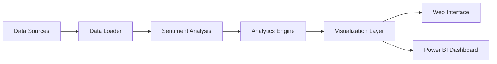

# 📊 Financial Sentiment Dashboard

<div align="center">


[](https://github.com/yourusername/financial-sentiment-dashboard/graphs/commit-activity)

A powerful financial analytics platform that combines real-time market data with advanced sentiment analysis using state-of-the-art NLP models.

[Features](#features) • [Installation](#installation) • [Usage](#usage) • [Architecture](#architecture) • [Contributing](#contributing)


</div>

## 🚀 Features

- **Real-time Data Collection**
  - Financial news aggregation from multiple sources
  - Stock market data via Yahoo Finance API
  - Customizable data filters and sources

- **Advanced Sentiment Analysis**
  - Powered by HuggingFace Transformers
  - DistilBERT model fine-tuned for financial text
  - Multi-language support
  
- **Comprehensive Analytics**
  - Trend analysis using Pandas/NumPy
  - Technical indicators and statistical metrics
  - Correlation analysis between news sentiment and market movements


## 📦 Installation

### Prerequisites
- Python 3.7+
- PHP 7.4+ (for web interface)
- Power BI Desktop (for dashboard visualization)

### Quick Start

```bash
# Clone the repository
git clone https://github.com/yourusername/financial-sentiment-dashboard.git

# Create and activate virtual environment
python -m venv venv
source venv/bin/activate  # Linux/Mac
venv\Scripts\activate     # Windows

# Install dependencies
pip install -r requirements.txt

# Set up environment variables
cp .env.example .env
# Edit .env with your API keys
```

## 🎯 Usage

### Data Collection
```bash
python src/financial_sentiment_dashboard/main.py
```

### Dashboard Access
1. Start local PHP server:
```bash
php -S localhost:8000 -t web/
```
2. Open `http://localhost:8000` in your browser


## 🏗 Architecture



## 📊 Sample Results

### Sentiment Distribution


### Price vs Sentiment Correlation


## 🔧 Configuration

| Parameter | Description | Default |
|-----------|-------------|---------|
| `NEWS_API_KEY` | API key for news data | Required |
| `DAYS_AGO` | Historical data range | 7 |
| `SENTIMENT_MODEL` | HuggingFace model name | distilbert-base-uncased |

## 🤝 Contributing

Contributions are welcome! Please read our [Contributing Guide](CONTRIBUTING.md) for details on our code of conduct and the process for submitting pull requests.

1. Fork the repository
2. Create your feature branch (`git checkout -b feature/AmazingFeature`)
3. Commit your changes (`git commit -m 'Add some AmazingFeature'`)
4. Push to the branch (`git push origin feature/AmazingFeature`)
5. Open a Pull Request

## 📝 License

This project is licensed under the MIT License - see the [LICENSE](LICENSE) file for details.

## 🙏 Acknowledgments

- HuggingFace team for their amazing transformers library
- Yahoo Finance for market data access
- Contributors and maintainers

---

<div align="center">
Made with ❤️ by MD.SAMEER SAYED

[Report Bug](https://github.com/yourusername/financial-sentiment-dashboard/issues) • [Request Feature](https://github.com/yourusername/financial-sentiment-dashboard/issues)
</div>